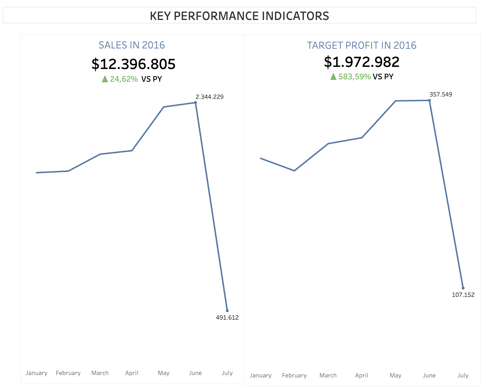
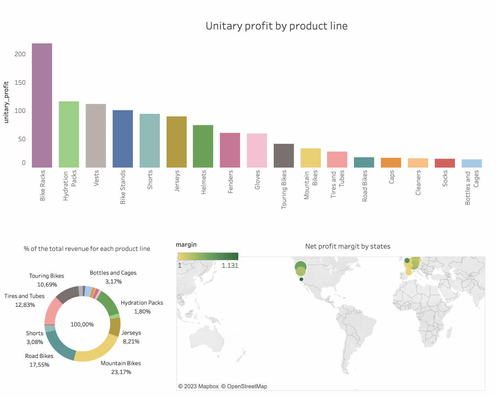
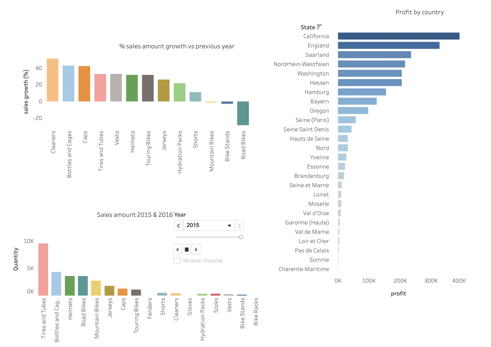
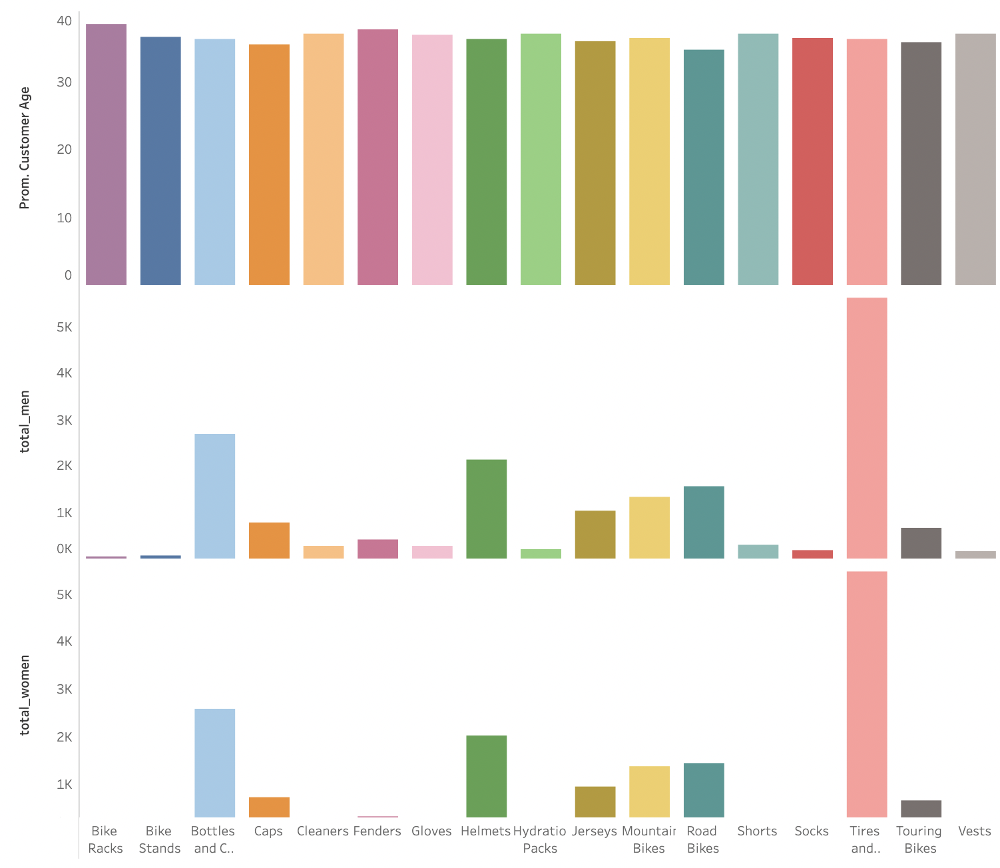

# Retail Project: A throughout Product, Sales and Marketing overview 📊

## As a consulting firm, in this projects we will be analysis the current state of the sales of a retail chain across multiple sites, products and months. The goal is to provide valuable insights in order to make crucial business decisions. 

### The company is going through a bad financial situation and needs to cut costs somehow. They have asked us to make some decisive decision for the company to move forward.

#### Metrics to analyze:

- profit and profit margins from the cost of the product and the revenue generated from its sale.
- volume of products sold, which could be used to analyze sales trends over time.
- purchasing behavior across different demographic groups
- Segmentation (M/F) and age.
- Real-time KPI tracking dashboard to analyze company performance.

### Results:

[Tableau](https://public.tableau.com/app/profile/miguel.palos.pou/viz/sales_16847743934250/Story1?publish=yes)

